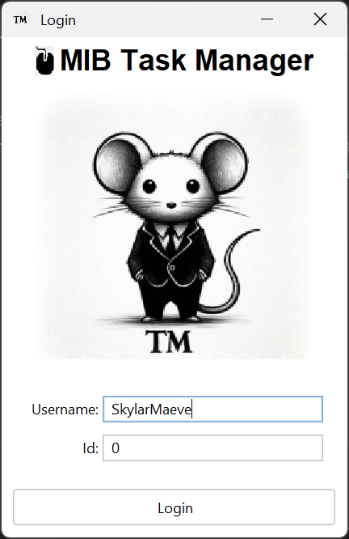
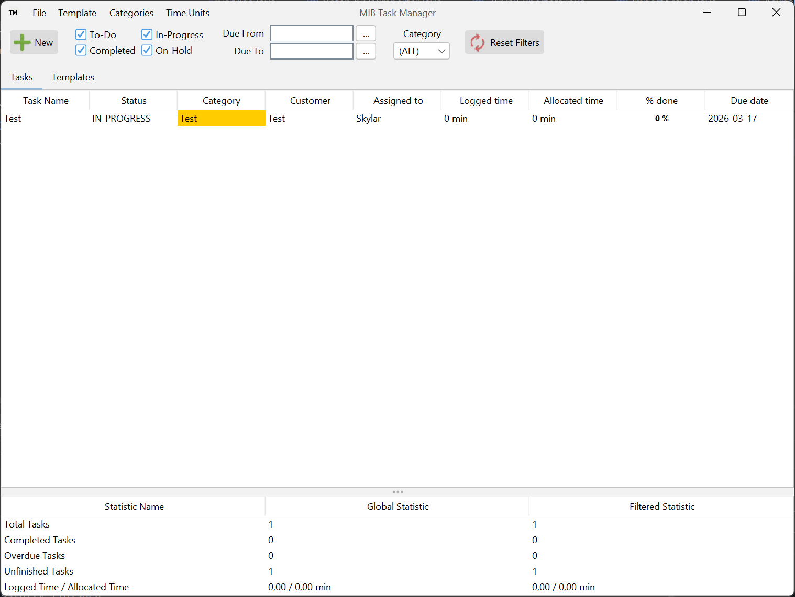
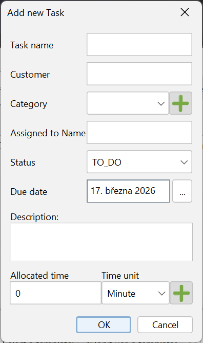
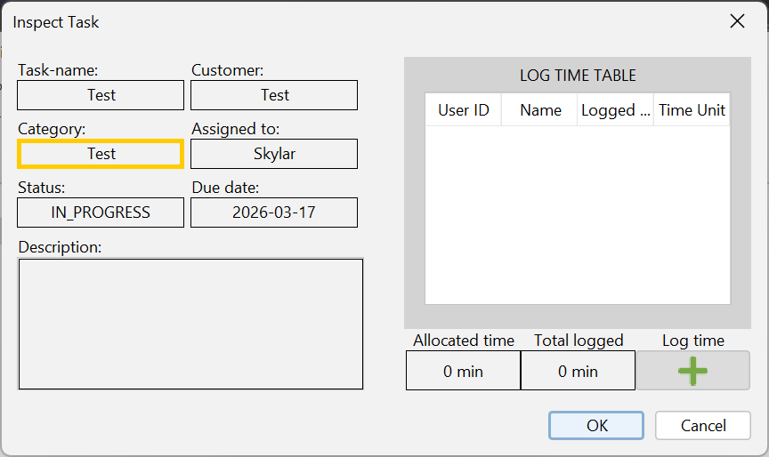

# Task-Manager

Authors:
| Role | Person |
|----------------|--------------------------------------------------------|
|Team Lead | [Vladimír Borek](https://is.muni.cz/auth/osoba/536583) |
|Member | [Marcel Nadzam](https://is.muni.cz/auth/osoba/536407) |
|Member | [Maroš Pavlík](https://is.muni.cz/auth/osoba/536589) |
|Member | [Nikol Otáhalová](https://is.muni.cz/auth/osoba/536358)|

Subject: PV168 Java

Personal responsibility: Front-end, design style, export and import of data

A desktop application for employees to keep track of their tasks.

Screenshots:

